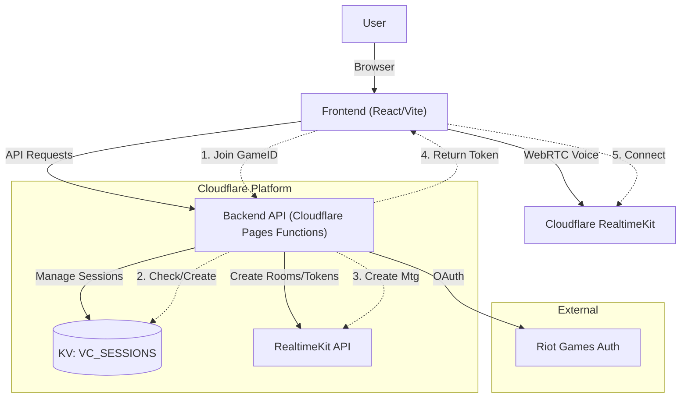
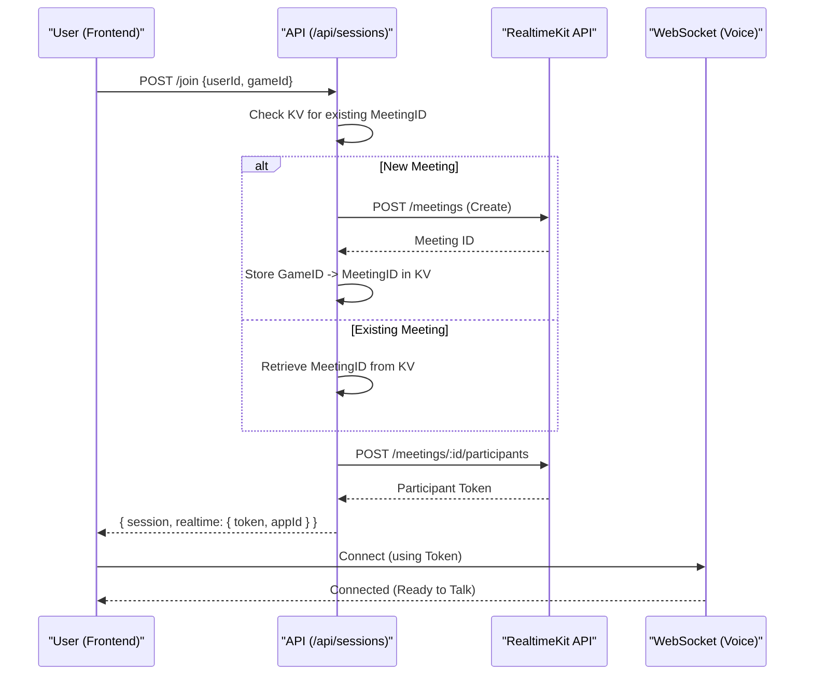

# VoiceParty.lol

A real-time voice chat application designed for gamers, featuring "Game ID" based room creation and Riot Games authentication.

## Architecture

The system uses a serverless architecture powered by Cloudflare's ecosystem.



## Tech Stack

- **Frontend**: React, TypeScript, Vite, Material UI (MUI), Cloudflare RealtimeKit React SDK.
- **Backend**: Cloudflare Pages Functions (Hono Framework).
- **Database**: Cloudflare KV (Session persistence).
- **Realtime**: Cloudflare RealtimeKit (WebRTC Audio).
- **Auth**: Riot Games (OAuth 2.0).

## RealtimeKit Connection Flow

Steps to establish a voice connection:



## References

- [Introduction to Voice Conferencing - Cloudflare RealtimeKit Docs](https://docs.realtime.cloudflare.com/guides/voice-conf/intro-voice-conf)

## Features

- **Game ID Rooms**: Join or create voice rooms simply by entering a Game ID.
- **Auto-Creation**: Rooms are automatically created on-demand if they don't exist.
- **Mock Mode**: Built-in mock mode for development and testing without requiring live API keys.
- **Riot Auth**: Secure identity verification via Riot Games accounts.

## Getting Started

### Prerequisites

- Node.js (v18+)
- pnpm
- Cloudflare Wrangler CLI

### Installation

```bash
pnpm install
```

### Development (Real Mode)

Requires `wrangler.toml` or `.dev.vars` configured with real API credentials.

```bash
pnpm dev
# Backend runs at http://localhost:8788
# Frontend proxies /api requests to Backend
```

### Development (Mock Mode)

Run without needing RealtimeKit or Riot credentials. Uses simulated voice connection and mocked API.

1. Set default env var or use `.dev.vars`:

    ```bash
    USE_MOCK_REALTIME="true"
    ```

2. Run:

    ```bash
    pnpm dev
    ```

### Testing

Run the test suite (defaults to Mock Mode):

```bash
pnpm test
```

### Storybook E2E Testing

This project includes Storybook Test Runner for E2E testing of components.

**Run Storybook E2E tests:**

1. Start Storybook in one terminal:
   ```bash
   pnpm storybook
   ```

2. In another terminal, run the test runner:
   ```bash
   pnpm test-storybook
   ```

**For CI/CD:**
```bash
pnpm test-storybook:ci
```

The test runner automatically:
- Tests all stories with `play` functions
- Validates component interactions
- Checks accessibility
- Verifies visual states

See [JoinSessionForm.stories.tsx](./src/components/VoiceChat/JoinSessionForm.stories.tsx) for examples of E2E tests using the `play` function.

## Developer Guide

For detailed project analysis, directory structure, and internal workflows, see [AGENT.md](./AGENT.md).
