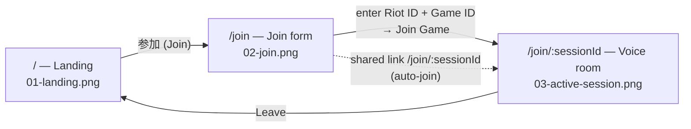

# User flow (導線)

Three screens, driven by React Router. Screenshots of the current design live
in `design/screens/` and can be imported into Penpot to review the flow (see
[penpot-review.md](./penpot-review.md)).



## Screens

| # | Route | Screen | File |
|---|-------|--------|------|
| 1 | `/` | Landing — hero + primary CTA | `screens/01-landing.png` |
| 2 | `/join` | Join form — Riot ID + Game ID | `screens/02-join.png` |
| 3 | `/join/:sessionId` | Active voice session — participants, mic/leave | `screens/03-active-session.png` |

## Transitions

- **Landing → Join**: the `参加 (Join)` button navigates to `/join`.
- **Join → Voice room**: submitting the form navigates to `/join/:sessionId`
  and joins the room. Opening a shared `/join/:sessionId` link auto-joins when a
  Summoner ID is already stored.
- **Voice room → Landing**: `Leave` (end-call) returns to `/`.

## Regenerating the screenshots

The images are rendered from the running app, so refresh them after UI changes:

```bash
pnpm dev            # or: pnpm dev:frontend + pnpm dev:backend
# open the routes in a browser and capture:
#   /                 → design/screens/01-landing.png
#   /join             → design/screens/02-join.png
#   /join/<any-id>    → design/screens/03-active-session.png  (needs a Summoner ID entered)
```
