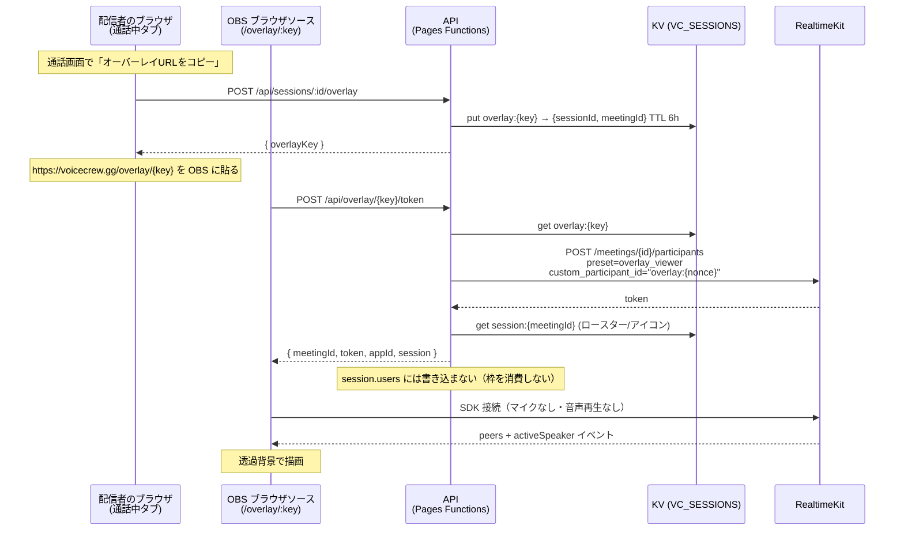

# 配信者向けオーバーレイ 設計

配信者が VoiceCrew の参加者一覧（アイコン・名前・発話中インジケータ）を OBS の
ブラウザソースとして配信画面に載せるための機能設計。

- 作成日: 2026-07-17
- ステータス: **設計のみ（未実装）**
- 対象: `/overlay/:overlayKey` ルート、`POST /api/sessions/:id/overlay`、`POST /api/overlay/:key/token`

---

## 1. 目的とスコープ

配信者が Discord の代わりに VoiceCrew を使う動機を作る。Discord のオーバーレイは
デスクトップアプリのウィンドウキャプチャに依存するが、VoiceCrew はブラウザ完結
なので **URL を OBS に貼るだけ** で成立する。これは既存アーキテクチャ上の優位点で、
機能の中心的な訴求になる。

### やること

- 参加者のアイコン・Riot ID・発話中リングを透過背景で描画する専用ページ
- 配信者が通話画面から「オーバーレイ URL をコピー」できる導線
- レイアウト（縦/横）・サイズ等の軽いカスタマイズ

### やらないこと（今回のスコープ外）

- 配信画面へのチャット表示、視聴者向けインタラクション
- 配信者によるリモートミュート等のモデレーション操作（別設計）
- Twitch/YouTube API 連携

---

## 2. 前提となる既存の事実

設計判断の根拠になる、現状のコードから確認した制約。

| 事実 | 場所 | 設計への影響 |
|---|---|---|
| 発話状態はブラウザローカル。SDK の `activeSpeaker` イベントから導出し、**バックエンドには一切送っていない** | `useRealtime.ts:185-204` | オーバーレイが発話状態を得るには SDK 接続が要る。ポーリングでは取れない |
| 発話は 900ms のハングオーバー付きで消える | `useRealtime.ts:11` | オーバーレイでも同じ定数を共有すべき（チラつき防止） |
| ピア識別子は `customParticipantId \|\| name \|\| summonerId \|\| id` の順で解決 | `ActiveSessionView.tsx:230-248` | オーバーレイ参加者に prefix を付ければ既存ロジックで識別・除外できる |
| アイコンは KV の `Session.users[].iconUrl` をピアに Riot ID で join して得る | `ActiveSessionView.tsx:696-703` | オーバーレイもロースター取得が必要 |
| `iconUrl` は Riot バリデーション有効時のみ埋まる。現在 `RIOT_VALIDATION_ENABLED = "false"` | `wrangler.toml:14-15` | **今のところアイコンは実質 `undefined`**。フォールバック必須 |
| 参加者上限 `MAX_USERS = 5`。KV の `session.users` は追記のみで削除されない | `sessions.ts:15`, `:225-237` | オーバーレイを `users` に足してはいけない |
| 空き枠判定は RealtimeKit の active-session の実数を使う | `realtime.ts:41`, `getActiveParticipantCount` | **オーバーレイが参加者数を水増しし、5人目の実ユーザーを弾く恐れ**（§7 で対処） |
| 参加時のプリセットは `group_call_participant` 固定 | `sessions.ts:280` | オーバーレイ用に音声を出せないプリセットが別途要る |
| セッションに認証はない。Riot ID 自己申告のみ | `sessions.ts:97-` | オーバーレイ URL 自体が事実上の資格情報になる（§8） |
| Durable Objects は未使用。KV のみ | `wrangler.toml` | サーバ経由の push チャンネルは新インフラなしには作れない |
| `/join/<id>` は `noindex, follow` にしている | `_middleware.ts:118` | `/overlay/*` も同様に扱う |

---

## 3. 設計上の中心的な課題

**OBS のブラウザソースは、配信者の Chrome とは別のブラウザプロセス（OBS 内蔵 CEF）である。**

つまりオーバーレイページは、配信者が通話しているタブの JavaScript 状態に一切
アクセスできない。`BroadcastChannel` も `localStorage` も **プロセスを跨がないので使えない**。

そして §2 の通り、発話状態はそのタブのメモリにしか存在しない。

> オーバーレイに発話状態を届ける経路を、ゼロから決める必要がある。

これが本設計の唯一の本質的な論点で、他はすべてこの帰結。

---

## 4. 方式の比較

| | A. 隠し参加者として SDK 接続 | B. presence API をポーリング | C. 配信タブから push |
|---|---|---|---|
| 発話状態 | ✅ SDK からネイティブに取得 | ❌ **取得不可**（API にない） | ✅ 取得可 |
| 遅延 | ✅ リアルタイム（既存と同じ） | ⚠️ ポーリング間隔ぶん | ✅ リアルタイム |
| 新規インフラ | 不要 | 不要 | ❌ **Durable Objects 必須** |
| 追加コスト | ⚠️ 参加者1名分の従量課金 | ⚠️ API 呼び出し（1秒間隔×配信時間） | DO 課金 |
| 実装量 | 小（`useRealtime` を再利用） | 小 | 大 |
| 配信タブへの依存 | なし（独立して動く） | なし | ❌ タブを閉じると停止 |

**採用: A（隠し参加者）。**

B は発話状態が取れない時点で機能要件を満たさない（参加者リストが静止画になる）。
C は品質は同等だが、この機能のためだけに Durable Objects を導入するのは割に合わず、
かつ配信タブが落ちるとオーバーレイも死ぬという運用上の脆さがある。

A の代償は「オーバーレイが RealtimeKit の参加者として1名分カウントされる」こと。
これは §7 で明示的に処理する。

---

## 5. アーキテクチャ



---

## 6. 追加する要素

### 6.1 ルーティング

`/overlay/:overlayKey` を **`LangLayout` / `AppShell` の外側** に置く（`App.tsx:16-39` の
`<Routes>` 直下）。理由:

- `AppShell` はブランド背景・ヘッダ・フッタを描く。オーバーレイは透過でなければならない
- `LangLayout` は言語リダイレクトを行う。オーバーレイ URL がリダイレクトされると OBS 側で壊れる

言語はクエリ `?lang=ja` で明示的に受ける（オーバーレイの表示文言はごく少ないが、
「接続中」等のステータスに要る）。

`overlayKey` だけで `sessionId` / `meetingId` / リージョンが KV から引けるので、
URL にリージョンを含める必要はない（`/join/:region/:sessionId` と違う点）。

`functions/_middleware.ts:118` の `noindex` 判定に `/overlay/` を追加する。

### 6.2 API

| メソッド | パス | 用途 |
|---|---|---|
| `POST` | `/api/sessions/:id/overlay` | オーバーレイキーを発行/再発行。body: `{ summonerId }`（セッション参加者のみ） |
| `POST` | `/api/overlay/:key/token` | オーバーレイ用の RealtimeKit トークン + ロースターを返す |

`GET` ではなく `POST` にするのは、トークン発行が副作用（RealtimeKit への参加者追加）を
伴うため。OBS のブラウザソースはページを読み込むだけなので、発行はページ内 JS から行う。

### 6.3 KV スキーマ追加

```
overlay:{overlayKey}  →  { sessionId, meetingId, createdAt }   TTL 6h
```

- `overlayKey`: `crypto.randomUUID()` 相当の推測不能な値（既存の `hash.ts` とは別用途なので単純乱数でよい）
- TTL は `session:{meetingId}` と揃えて 6h。セッションと同時に失効する
- 再発行時は旧キーを `delete` してから新キーを `put`（URL 流出時の revoke 手段）

`session:{meetingId}` の形（`_types.ts:24-29`）は**変更しない**。オーバーレイは
ロースターの読み取り専用利用者。

### 6.4 フロントエンド

```
src/pages/OverlayPage.tsx           ルート。key を読み、トークン取得 → 接続
src/components/Overlay/
  ├── OverlayRoster.tsx             参加者リストの描画（透過）
  ├── OverlayAvatar.tsx             1人分。アイコン + 発話リング
  ├── OverlayRoster.stories.tsx     モックピアで見た目を確認（ActiveSessionView.stories.tsx が雛形）
  └── options.ts                    クエリパラメータのパース + 既定値
```

`useRealtime` は**そのまま再利用する**（`peers` / `activeSpeakers` / `connectionState` が
まさに必要なもの）。ただし §7 の音声まわりのため、オプション引数を1つ足す:

```ts
useRealtime({ mode: "overlay" })   // 既定は "participant"
```

`mode: "overlay"` のとき:
- マイク取得・`enableAudio` を一切呼ばない
- ノイズ抑制ミドルウェアを組まない（`noiseSuppression.ts` を触らない）
- 音声トラックを `<audio>` に attach しない

発話リングは `BrandMark.tsx` が既に `speaking?: boolean` で外側アークを脈動させるので、
これを流用できる（ブランドの一貫性も取れる）。

ハングオーバー定数 `SPEAKING_HANGOVER_MS`（`useRealtime.ts:11`）は共有のまま使う。

### 6.5 カスタマイズ（クエリパラメータ）

OBS 側で URL を書き換えるだけで調整できるようにする。設定 UI は作らない。

| パラメータ | 既定 | 値 |
|---|---|---|
| `layout` | `column` | `column` \| `row` |
| `size` | `md` | `sm` \| `md` \| `lg` |
| `labels` | `1` | `0` で Riot ID を隠しアイコンのみ（ID を配信に映したくない配信者向け） |
| `idle` | `show` | `hide` で発話中の人だけ表示 |
| `lang` | `en` | `ja` \| `ko` \| `zh-TW` |

不正値は既定にフォールバックする（OBS 側でエラーが見えないため、絶対に落とさない）。

---

## 7. 明示的に処理が必要な副作用

方式 A を採ることで生じる問題。**すべて実装時に対処が必須。**

### 7.1 音声の二重再生（最重要）

オーバーレイが SDK 接続すると、既定では他ピアの音声トラックが再生される。
配信者のデスクトップ音声は OBS が既にキャプチャしているので、**同じ音声が二重に
配信に乗る**（かつ僅かにズレるのでフランジングして聞くに耐えない）。

対処: `mode: "overlay"` で音声トラックを attach しない（§6.4）。加えて RealtimeKit 側でも
**音声を購読・生成できないプリセット**を用意して二重に防ぐ。

### 7.2 空き枠判定の水増し

`getActiveParticipantCount`（`realtime.ts:41`）は active-session の参加者を数えて
`MAX_USERS = 5` の判定に使われる。オーバーレイ参加者がここに混ざると、
**実ユーザー5人 + オーバーレイ = 6 と数え、正当な5人目が弾かれる。**

対処: `custom_participant_id` に `overlay:` prefix を付け、`getActiveParticipantCount` で
prefix 一致を除外して数える。
ただし同関数は API が参加者リストを返さず `live_participants`（数値のみ）だった場合の
フォールバック経路を持つ（`realtime.ts:75-76`）。この経路では除外できないので、
**数値フォールバック時は `null` を返す**（＝呼び出し側が KV ロースターにフォールバック）
ように縮退させる。既存の contract 上、`null` は安全側に倒れる設計なので整合する。

### 7.3 他の参加者のロースターに幽霊が出る

オーバーレイは本物のピアなので、他の参加者の `ActiveSessionView` に現れてしまう。

対処: `peers` を描画する箇所（`ActiveSessionView.tsx:512`, `:696`）で
`customParticipantId` が `overlay:` で始まるピアを除外する。参加人数表示
（`:658` の `peers.length + 1`）からも除外する。

> これは既存コンポーネントへの変更になるので、オーバーレイ本体より**先に**入れる
> （§10 の Phase 1）。順序を逆にすると、オーバーレイを開いた瞬間に全員の画面が壊れる。

### 7.4 プリセットの用意

RealtimeKit ダッシュボードで音声の produce/consume を不可にしたプリセット
（仮称 `overlay_viewer`）を作り、env で渡す:

```
REALTIME_OVERLAY_PRESET = "overlay_viewer"
```

`wrangler.toml` の `[vars]` に置く（シークレットではない）。`_types.ts:1-16` の
`Bindings` にも追加。追加手順は `.claude/skills/add-env-var` に従う。

### 7.5 課金

オーバーレイは参加者1名として従量課金される。配信中ずっと接続しっぱなしになるため、
無視できない可能性がある。実装前に RealtimeKit の料金体系（participant-minutes か
audio-minutes か）を確認する。**音声を送受信しない参加者が課金対象外なら問題なし。**
→ §11 の未決事項。

---

## 8. セキュリティとプライバシー

現状セッション自体に認証がない（Riot ID の自己申告のみ）ので、オーバーレイが
新種の脆弱性を持ち込むわけではない。ただし性質は悪化する:

**通常の参加者は他人から見える。オーバーレイ参加者は見えない（§7.3 で除外するため）。**
つまりオーバーレイ URL が漏れると、**誰にも気づかれずに通話を盗聴できる。**

これは受け入れられないので:

1. **`overlayKey` は推測不能**にする。`sessionId`（人間が読める Game ID）から導出しない
2. **プリセットで音声 consume を不可にする**（§7.4）。トークンが漏れても音は取れない。
   これが実質的な防御線であり、URL の秘匿は二次的な防御に留める
3. **再発行導線を必ず出す**。「配信に URL を映してしまった」は起きる。通話画面から
   ワンクリックで revoke + 再発行できるようにする
4. `overlay:` prefix は**サーバ側で強制**する。クライアントから任意の
   `custom_participant_id` を受け取らない（受け取ると `overlay:` を騙って
   ロースターから消える幽霊を誰でも作れてしまう）

`/overlay/*` は `noindex`（§6.1）。オーバーレイページはアイコンと Riot ID を
表示するが、これらは既に通話参加者に開示されている情報なので、
データ取扱い（`docs/data-handling.md`）の区分は変わらない。
`labels=0` で Riot ID を隠せるようにする（§6.5）のは配信者側の自衛手段。

---

## 9. i18n / テーマ

- 文言は `session.*` と別に `overlay.*` キーで追加。`ja` / `en` / `ko` / `zh-TW` の
  4ロケール全てに入れる（`zh-TW.ts` は法務文書のみ部分的なので、UI 文言は対象）
- 文言はごく少数（`overlay.connecting` / `overlay.disconnected` / `overlay.empty`）
- 色は `design/tokens.json` のトークン経由（`--color-*`）。生成物を手で書かない
- 背景は**必ず透過**。`AppShell` の外なので `CssBaseline` の背景が乗らないことを
  Storybook で確認する（`.storybook/preview.tsx` は背景を敷くので、story 側で明示的に切る）

---

## 10. 実装計画（PR 分割）

| Phase | 内容 | 依存 |
|---|---|---|
| **1** | `overlay:` prefix ピアを既存ロースターから除外（§7.3）+ `getActiveParticipantCount` の除外/縮退（§7.2） | なし。**先行必須** |
| **2** | RealtimeKit プリセット作成 + `REALTIME_OVERLAY_PRESET` 追加（§7.4） | なし |
| **3** | API 2本 + KV `overlay:{key}`（§6.2, §6.3） | 2 |
| **4** | `useRealtime({ mode: "overlay" })` の音声抑止（§6.4, §7.1） | なし |
| **5** | `/overlay/:key` ルート + 描画 + Storybook（§6.1, §6.4） | 3, 4 |
| **6** | 通話画面に「オーバーレイURLをコピー / 再発行」導線 + i18n（§8-3, §9） | 3 |

Phase 1 を単独で先に入れられるのが要点。これだけなら挙動は変わらず（現状 `overlay:`
prefix のピアは存在しない）、後続を安全に積める。

## 11. テスト

- `functions/api/index.test.ts` の方式（モック KV + `app.request`）でトークン発行 API:
  存在しないキー / 期限切れキー / 再発行で旧キーが無効になること
- `getActiveParticipantCount` の除外ロジックは純粋関数に切り出して単体テスト。
  特に**数値フォールバック時に `null` を返す**縮退（§7.2）
- `OverlayRoster` の Storybook: 0人 / 1人 / 5人 / 発話中 / アイコンなし（現状の既定）/
  `idle=hide`
- `mode: "overlay"` でマイク取得が呼ばれないことを `VoiceChat.test.tsx` の
  モックパターンで検証
- **手動確認が必須**: 実際に OBS のブラウザソースに貼り、(a) 背景が透過しているか、
  (b) 音声が二重に乗らないか。これは自動テストで代替できない

---

## 12. 未決事項

1. **課金**（§7.5）— 音声を送受信しない参加者が participant-minutes として課金されるか。
   課金されるなら方式 C（Durable Objects）の再検討もありうる
2. **プリセットで consume を無効化できるか** — RealtimeKit のプリセット設定で
   音声購読の禁止が本当に可能か要確認。不可なら §8-2 の防御線が消え、
   URL 秘匿だけが頼りになる（設計を見直す）
3. **アイコン** — `RIOT_VALIDATION_ENABLED = "false"` の間はアイコンが出ない。
   オーバーレイの訴求はアイコンありきなので、RSO 本番承認までは
   イニシャル/ブランドマークのフォールバックで見栄えを作る必要がある
4. **6h TTL** — 長時間配信で切れる。セッション側と同様に「アクセス毎に TTL 延長」
   にするか要検討
